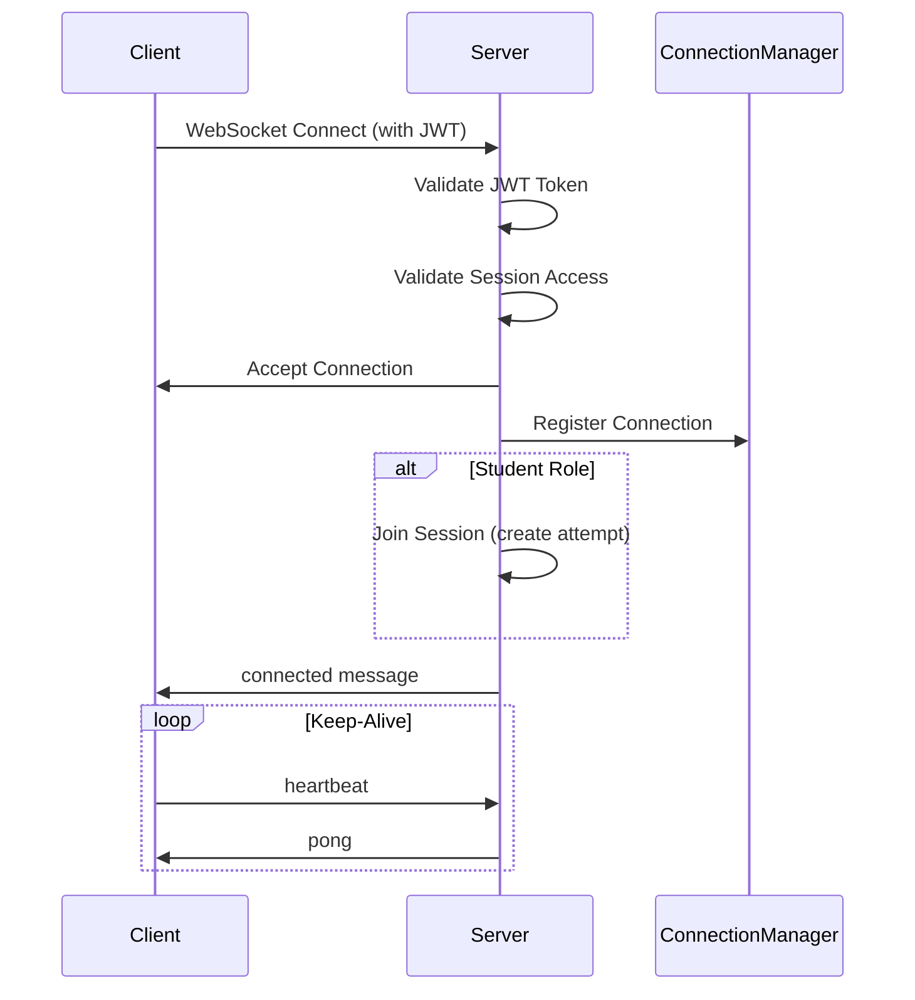
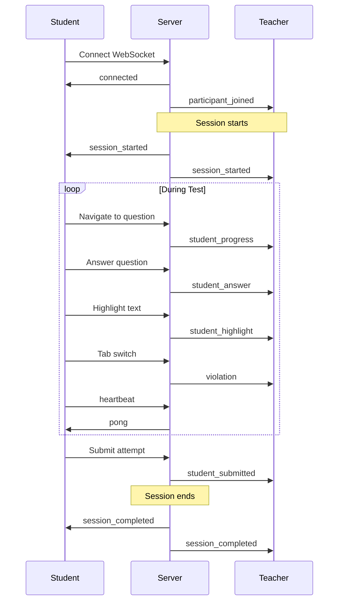
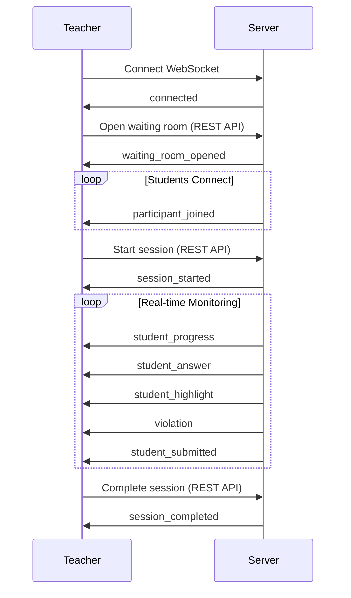

# WebSocket API Documentation

## Overview

This document provides comprehensive documentation for the WebSocket API used in the FastAPI testing platform. The WebSocket connection enables real-time communication between clients (students and teachers) and the server during test sessions.

## Table of Contents

- [Connection](#connection)
- [Authentication](#authentication)
- [Message Types](#message-types)
  - [Client to Server Messages](#client-to-server-messages)
  - [Server to Client Messages](#server-to-client-messages)
- [Message Flow](#message-flow)
- [Error Handling](#error-handling)
- [Best Practices](#best-practices)
- [Code Examples](#code-examples)

---

## Connection

### Endpoint

```
ws://your-domain.com/api/v1/websocket/{session_id}/ws?token={jwt_token}
```

or for secure connections:

```
wss://your-domain.com/api/v1/websocket/{session_id}/ws?token={jwt_token}
```

### Parameters

| Parameter | Type | Location | Required | Description |
|-----------|------|----------|----------|-------------|
| `session_id` | string | Path | Yes | The unique identifier of the test session |
| `token` | string | Query | Yes | JWT authentication token |

### Connection Flow



---

## Authentication

### JWT Token Requirements

The WebSocket connection requires a valid JWT token passed as a query parameter. The token must contain:

```json
{
  "user_id": "string",
  "role": "STUDENT" | "TEACHER" | "ADMIN",
  "exp": 1234567890
}
```

### Access Control

**Students:**
- Can only connect to sessions where they are enrolled in the class
- Automatically join the session upon connection
- Disconnect triggers automatic cleanup

**Teachers:**
- Can connect to sessions for classes they teach
- Receive real-time updates about all student activities
- Do not trigger session join/leave events

**Admins:**
- Can connect to any session
- Same capabilities as teachers

### Connection Rejection

The server will close the WebSocket connection with code `1008` (Policy Violation) if:
- JWT token is invalid or expired
- User doesn't have access to the session
- Session doesn't exist

---

## Message Types

All messages are sent and received as JSON objects with a `type` field that identifies the message type.

### Client to Server Messages

#### 1. Heartbeat Message

Keep the connection alive and verify server responsiveness.

**Client Sends:**
```json
{
  "type": "heartbeat"
}
```

**Server Responds:**
```json
{
  "type": "pong"
}
```

**Recommended Interval:** Every 30 seconds

---

### Server to Client Messages

#### 1. Connected Message

Sent immediately after successful WebSocket connection.

```json
{
  "type": "connected",
  "session_id": "550e8400-e29b-41d4-a716-446655440000",
  "timestamp": "2026-01-18T10:30:00.000Z"
}
```

**Recipient:** All users (students and teachers)

---

#### 2. Session Status Changed Message

Sent when the session status changes (WAITING → IN_PROGRESS → COMPLETED).

```json
{
  "type": "session_status_changed",
  "session_id": "550e8400-e29b-41d4-a716-446655440000",
  "status": "IN_PROGRESS",
  "timestamp": "2026-01-18T10:30:00.000Z"
}
```

**Status Values:**
- `SCHEDULED`: Session is scheduled but not yet open
- `WAITING`: Waiting room is open, students can connect
- `IN_PROGRESS`: Test is actively running
- `COMPLETED`: Test has ended
- `CANCELLED`: Session was cancelled

**Recipient:** All users

**Client Action:**
- Update UI to reflect session status
- Start/stop timer when status changes to/from IN_PROGRESS
- Lock/unlock test interface accordingly

---

#### 3. Waiting Room Opened Message

Sent when the teacher opens the waiting room.

```json
{
  "type": "waiting_room_opened",
  "session_id": "550e8400-e29b-41d4-a716-446655440000",
  "timestamp": "2026-01-18T10:25:00.000Z"
}
```

**Recipient:** All users

**Client Action:**
- Allow students to connect
- Show "waiting room" UI to students

---

#### 4. Session Started Message

Sent when the teacher starts the test session.

```json
{
  "type": "session_started",
  "session_id": "550e8400-e29b-41d4-a716-446655440000",
  "started_at": "2026-01-18T10:30:00.000Z",
  "connected_students": [
    "user-id-1",
    "user-id-2",
    "user-id-3"
  ],
  "timestamp": "2026-01-18T10:30:00.000Z"
}
```

**Recipient:** All users

**Client Action (Students):**
- Start the test timer
- Enable test interface
- Begin tracking time

**Client Action (Teachers):**
- Show list of connected students
- Update monitoring dashboard

---

#### 5. Session Completed Message

Sent when the session ends (time limit reached or manually completed).

```json
{
  "type": "session_completed",
  "session_id": "550e8400-e29b-41d4-a716-446655440000",
  "completed_at": "2026-01-18T11:30:00.000Z",
  "timestamp": "2026-01-18T11:30:00.000Z"
}
```

**Recipient:** All users

**Client Action (Students):**
- Auto-submit the attempt if not already submitted
- Lock the test interface
- Show completion message

**Client Action (Teachers):**
- Stop real-time monitoring
- Show final statistics

---

#### 6. Participant Joined Message

Sent when a student connects to the session.

```json
{
  "type": "participant_joined",
  "session_id": "550e8400-e29b-41d4-a716-446655440000",
  "student_id": "user-id-1",
  "connected_count": 15,
  "timestamp": "2026-01-18T10:28:00.000Z"
}
```

**Recipient:** All users

**Client Action (Teachers):**
- Update participant list
- Show notification
- Update connected count badge

**Client Action (Students):**
- Optional: Show other participants count

---

#### 7. Participant Disconnected Message

Sent when a student disconnects from the session.

```json
{
  "type": "participant_disconnected",
  "session_id": "550e8400-e29b-41d4-a716-446655440000",
  "student_id": "user-id-1",
  "connected_count": 14,
  "timestamp": "2026-01-18T10:45:00.000Z"
}
```

**Recipient:** All users

**Client Action (Teachers):**
- Update participant list
- Show notification
- Update connected count badge

---

#### 8. Student Progress Message (**Teachers Only**)

Sent when a student navigates to a different question.

```json
{
  "type": "student_progress",
  "session_id": "550e8400-e29b-41d4-a716-446655440000",
  "student_id": "user-id-1",
  "student_name": "John Doe",
  "passage_index": 0,
  "question_index": 5,
  "question_number": 6,
  "timestamp": "2026-01-18T10:35:00.000Z"
}
```

**Recipient:** Teachers only

**Client Action:**
- Update student's current position in monitoring view
- Show which question student is viewing
- Update progress bar

**Note:** `question_number` is the absolute question number across all passages (1-based), while `passage_index` and `question_index` are 0-based indices.

---

#### 9. Student Answer Message (**Teachers Only**)

Sent when a student answers or updates an answer to a question.

```json
{
  "type": "student_answer",
  "session_id": "550e8400-e29b-41d4-a716-446655440000",
  "student_id": "user-id-1",
  "student_name": "John Doe",
  "question_id": "question-uuid",
  "question_number": 6,
  "answered": true,
  "is_update": false,
  "timestamp": "2026-01-18T10:36:00.000Z"
}
```

**Fields:**
- `answered`: Always `true` (indicates question has an answer)
- `is_update`: `true` if updating an existing answer, `false` if answering for the first time

**Recipient:** Teachers only

**Client Action:**
- Update answered questions count for student
- Mark question as answered in monitoring view
- Show notification if desired
- Update progress indicators

---

#### 10. Student Highlight Message (**Teachers Only**)

Sent when a student highlights text in a passage.

```json
{
  "type": "student_highlight",
  "session_id": "550e8400-e29b-41d4-a716-446655440000",
  "student_id": "user-id-1",
  "student_name": "John Doe",
  "text": "The first 100 characters of the highlighted text will be shown here for context...",
  "passage_id": "passage-uuid",
  "timestamp": "2026-01-18T10:37:00.000Z"
}
```

**Note:** The `text` field is truncated to the first 100 characters.

**Recipient:** Teachers only

**Client Action:**
- Update highlight count for student
- Show recent highlight in activity feed
- Track engagement metrics

---

#### 11. Violation Recorded Message (**Teachers Only**)

Sent when a student triggers a violation (tab switch, copy/paste, etc.).

```json
{
  "type": "violation",
  "student_id": "user-id-1",
  "violation_type": "TAB_SWITCH",
  "timestamp": "2026-01-18T10:40:00.000Z",
  "total_count": 3
}
```

**Violation Types:**
- `TAB_SWITCH`: Student switched to another browser tab/window
- `COPY_ATTEMPT`: Student attempted to copy text
- `PASTE_ATTEMPT`: Student attempted to paste text
- `RIGHT_CLICK`: Student right-clicked (context menu)
- `DEV_TOOLS`: Student opened browser developer tools
- `FULL_SCREEN_EXIT`: Student exited full-screen mode

**Recipient:** Teachers only

**Client Action:**
- Update violation count for student
- Show alert/notification
- Highlight student in monitoring view
- Log violation in activity timeline

---

#### 12. Student Submitted Message (**Teachers Only**)

Sent when a student submits their test attempt.

```json
{
  "type": "student_submitted",
  "session_id": "550e8400-e29b-41d4-a716-446655440000",
  "student_id": "user-id-1",
  "student_name": "John Doe",
  "score": 6.5,
  "time_taken_seconds": 3420,
  "answered_questions": 38,
  "total_questions": 40,
  "timestamp": "2026-01-18T11:27:00.000Z"
}
```

**Fields:**
- `score`: Band score (0-9 scale for IELTS) or `null` if not calculated yet
- `time_taken_seconds`: Time from session start to submission
- `answered_questions`: Number of questions answered
- `total_questions`: Total questions in test

**Recipient:** Teachers only

**Client Action:**
- Mark student as completed
- Show submission notification
- Update statistics
- Show score if available
- Calculate completion rate

---

#### 13. Session Stats Message (**Future Use**)

Placeholder for aggregated session statistics.

```json
{
  "type": "session_stats",
  "session_id": "550e8400-e29b-41d4-a716-446655440000",
  "stats": {
    "total_participants": 25,
    "connected_count": 23,
    "submitted_count": 2,
    "average_progress": 15,
    "total_violations": 8
  },
  "timestamp": "2026-01-18T10:45:00.000Z"
}
```

**Recipient:** Teachers only

**Note:** This message type is defined but not yet implemented. It will be used for periodic statistics broadcasts.

---

#### 14. Error Message

Sent when an error occurs on the server side.

```json
{
  "type": "error",
  "message": "Human-readable error message",
  "code": "ERROR_CODE"
}
```

**Common Error Codes:**
- `AUTH_FAILED`: Authentication failed
- `SESSION_NOT_FOUND`: Session doesn't exist
- `ACCESS_DENIED`: User doesn't have access
- `INVALID_MESSAGE`: Message format is invalid

**Recipient:** Individual user who caused the error

**Client Action:**
- Display error message to user
- Log error for debugging
- Attempt reconnection if appropriate

---

## Message Flow

### Student Test Taking Flow



### Teacher Monitoring Flow



---

## Error Handling

### Connection Errors

**Scenario:** WebSocket connection fails to establish

**Causes:**
- Invalid or expired JWT token
- Session doesn't exist
- User doesn't have access to session
- Network issues

**Client Handling:**
```javascript
ws.onerror = (error) => {
  console.error('WebSocket error:', error);
  // Show error message to user
  // Attempt to refresh token
  // Try to reconnect with exponential backoff
};

ws.onclose = (event) => {
  if (event.code === 1008) {
    // Policy Violation - likely auth issue
    // Redirect to login or refresh token
  } else {
    // Other close codes - attempt reconnection
    attemptReconnect();
  }
};
```

### Disconnection Handling

**Scenario:** WebSocket connection drops unexpectedly

**Client Handling:**
1. Detect disconnection in `onclose` event
2. Attempt automatic reconnection with exponential backoff
3. Preserve application state during reconnection
4. Resume from last known state after reconnection
5. Show connection status to user

**Reconnection Strategy:**
```javascript
const MAX_RETRIES = 5;
const INITIAL_DELAY = 1000;

async function reconnect(attempt = 1) {
  if (attempt > MAX_RETRIES) {
    // Show error message, redirect to session list
    return;
  }
  
  const delay = INITIAL_DELAY * Math.pow(2, attempt - 1);
  await sleep(delay);
  
  try {
    await connectWebSocket();
  } catch (error) {
    reconnect(attempt + 1);
  }
}
```

### Message Parsing Errors

**Scenario:** Received message cannot be parsed

**Client Handling:**
```javascript
ws.onmessage = (event) => {
  try {
    const message = JSON.parse(event.data);
    handleMessage(message);
  } catch (error) {
    console.error('Failed to parse message:', error);
    // Log error but don't crash
  }
};
```

---

## Best Practices

### 1. Connection Management

- **Keep-Alive:** Send heartbeat every 30 seconds to maintain connection
- **Reconnection:** Implement automatic reconnection with exponential backoff
- **State Sync:** After reconnection, fetch current state via REST API
- **Connection Status:** Show connection status indicator to users

### 2. Message Handling

- **Type Safety:** Validate message `type` field before processing
- **Error Boundaries:** Wrap message handlers in try-catch blocks
- **Logging:** Log all received messages in development mode
- **Throttling:** For high-frequency messages (progress updates), consider throttling UI updates

### 3. Student Client

- **Heartbeat:** Implement reliable heartbeat mechanism
- **State Preservation:** Save state locally in case of disconnection
- **Violation Detection:** Implement client-side violation detection and reporting
- **Auto-Submit:** Auto-submit when receiving `session_completed` message
- **Progress Debouncing:** Debounce progress updates (max 1 per 2 seconds)

### 4. Teacher Client

- **Message Buffering:** For high-activity sessions, buffer and batch UI updates
- **Filtering:** Allow teachers to filter/search student activities
- **Notifications:** Provide configurable notifications for different event types
- **Performance:** Use virtualization for large participant lists
- **Statistics:** Calculate and cache statistics client-side for better performance

### 5. Security

- **Token Refresh:** Refresh JWT token before expiration
- **Validate Messages:** Never trust message content without validation
- **Rate Limiting:** Respect server-side rate limits
- **Secure Connection:** Always use WSS (WebSocket Secure) in production

### 6. Testing

- **Mock Server:** Create mock WebSocket server for testing
- **Reconnection Testing:** Test all reconnection scenarios
- **Message Types:** Test handling of all message types
- **Error Cases:** Test error handling and edge cases

---

## Code Examples

### JavaScript/TypeScript Client

```typescript
class SessionWebSocket {
  private ws: WebSocket | null = null;
  private sessionId: string;
  private token: string;
  private heartbeatInterval: NodeJS.Timer | null = null;
  private reconnectAttempts = 0;
  private maxReconnectAttempts = 5;

  constructor(sessionId: string, token: string) {
    this.sessionId = sessionId;
    this.token = token;
  }

  connect(): Promise<void> {
    return new Promise((resolve, reject) => {
      const wsUrl = `wss://api.example.com/api/v1/websocket/${this.sessionId}/ws?token=${this.token}`;
      this.ws = new WebSocket(wsUrl);

      this.ws.onopen = () => {
        console.log('WebSocket connected');
        this.startHeartbeat();
        this.reconnectAttempts = 0;
        resolve();
      };

      this.ws.onmessage = (event) => {
        try {
          const message = JSON.parse(event.data);
          this.handleMessage(message);
        } catch (error) {
          console.error('Failed to parse message:', error);
        }
      };

      this.ws.onerror = (error) => {
        console.error('WebSocket error:', error);
        reject(error);
      };

      this.ws.onclose = (event) => {
        console.log('WebSocket closed:', event.code);
        this.stopHeartbeat();
        
        if (event.code !== 1000) { // Not normal closure
          this.attemptReconnect();
        }
      };
    });
  }

  private handleMessage(message: any): void {
    switch (message.type) {
      case 'connected':
        console.log('Connected to session:', message.session_id);
        break;
      
      case 'session_started':
        console.log('Session started:', message.started_at);
        // Start test timer, enable test interface
        break;
      
      case 'session_completed':
        console.log('Session completed');
        // Auto-submit if student, show completion message
        break;
      
      case 'student_progress':
        // Teacher only: update student position
        console.log(`${message.student_name} is on question ${message.question_number}`);
        break;
      
      case 'student_answer':
        // Teacher only: update answered questions count
        console.log(`${message.student_name} answered question ${message.question_number}`);
        break;
      
      case 'violation':
        // Teacher only: show violation alert
        console.warn(`Violation detected for student ${message.student_id}: ${message.violation_type}`);
        break;
      
      case 'student_submitted':
        // Teacher only: mark student as completed
        console.log(`${message.student_name} submitted with score ${message.score}`);
        break;
      
      case 'error':
        console.error('Server error:', message.message);
        break;
      
      case 'pong':
        // Heartbeat response
        break;
      
      default:
        console.warn('Unknown message type:', message.type);
    }
  }

  private startHeartbeat(): void {
    this.heartbeatInterval = setInterval(() => {
      if (this.ws?.readyState === WebSocket.OPEN) {
        this.ws.send(JSON.stringify({ type: 'heartbeat' }));
      }
    }, 30000); // Every 30 seconds
  }

  private stopHeartbeat(): void {
    if (this.heartbeatInterval) {
      clearInterval(this.heartbeatInterval);
      this.heartbeatInterval = null;
    }
  }

  private async attemptReconnect(): Promise<void> {
    if (this.reconnectAttempts >= this.maxReconnectAttempts) {
      console.error('Max reconnection attempts reached');
      // Show error to user, redirect to session list
      return;
    }

    this.reconnectAttempts++;
    const delay = Math.min(1000 * Math.pow(2, this.reconnectAttempts), 30000);
    
    console.log(`Reconnecting in ${delay}ms (attempt ${this.reconnectAttempts})`);
    
    await new Promise(resolve => setTimeout(resolve, delay));
    
    try {
      await this.connect();
      console.log('Reconnected successfully');
    } catch (error) {
      console.error('Reconnection failed:', error);
      // Will trigger another reconnect attempt via onclose
    }
  }

  disconnect(): void {
    this.stopHeartbeat();
    if (this.ws) {
      this.ws.close(1000, 'Client disconnect');
      this.ws = null;
    }
  }

  isConnected(): boolean {
    return this.ws?.readyState === WebSocket.OPEN;
  }
}

// Usage
const sessionWs = new SessionWebSocket('session-id', 'jwt-token');

try {
  await sessionWs.connect();
  console.log('Connected to session');
} catch (error) {
  console.error('Failed to connect:', error);
}

// Clean up on component unmount
sessionWs.disconnect();
```

### React Hook Example

```typescript
import { useEffect, useRef, useState } from 'react';

interface WebSocketMessage {
  type: string;
  [key: string]: any;
}

interface UseSessionWebSocketOptions {
  sessionId: string;
  token: string;
  onMessage?: (message: WebSocketMessage) => void;
}

export function useSessionWebSocket({ sessionId, token, onMessage }: UseSessionWebSocketOptions) {
  const [isConnected, setIsConnected] = useState(false);
  const [error, setError] = useState<Error | null>(null);
  const wsRef = useRef<WebSocket | null>(null);
  const heartbeatRef = useRef<NodeJS.Timer | null>(null);

  useEffect(() => {
    const wsUrl = `wss://api.example.com/api/v1/websocket/${sessionId}/ws?token=${token}`;
    const ws = new WebSocket(wsUrl);
    wsRef.current = ws;

    ws.onopen = () => {
      setIsConnected(true);
      setError(null);
      
      // Start heartbeat
      heartbeatRef.current = setInterval(() => {
        if (ws.readyState === WebSocket.OPEN) {
          ws.send(JSON.stringify({ type: 'heartbeat' }));
        }
      }, 30000);
    };

    ws.onmessage = (event) => {
      try {
        const message = JSON.parse(event.data);
        onMessage?.(message);
      } catch (err) {
        console.error('Failed to parse message:', err);
      }
    };

    ws.onerror = (event) => {
      setError(new Error('WebSocket error'));
    };

    ws.onclose = () => {
      setIsConnected(false);
      if (heartbeatRef.current) {
        clearInterval(heartbeatRef.current);
      }
    };

    return () => {
      if (heartbeatRef.current) {
        clearInterval(heartbeatRef.current);
      }
      ws.close();
    };
  }, [sessionId, token, onMessage]);

  return { isConnected, error };
}

// Usage in component
function StudentTestView({ sessionId, token }: Props) {
  const handleMessage = useCallback((message: WebSocketMessage) => {
    switch (message.type) {
      case 'session_started':
        startTestTimer();
        break;
      case 'session_completed':
        autoSubmitTest();
        break;
      // ... handle other messages
    }
  }, []);

  const { isConnected, error } = useSessionWebSocket({
    sessionId,
    token,
    onMessage: handleMessage
  });

  return (
    <div>
      <ConnectionStatus isConnected={isConnected} error={error} />
      {/* ... rest of component */}
    </div>
  );
}
```

---

## Message Type Summary

| Message Type | Direction | Recipient | Trigger |
|-------------|-----------|-----------|---------|
| `heartbeat` | Client → Server | - | Client keep-alive |
| `pong` | Server → Client | Sender | Response to heartbeat |
| `connected` | Server → Client | All | Connection established |
| `session_status_changed` | Server → Client | All | Status change |
| `waiting_room_opened` | Server → Client | All | Teacher opens waiting room |
| `session_started` | Server → Client | All | Teacher starts session |
| `session_completed` | Server → Client | All | Session ends |
| `participant_joined` | Server → Client | All | Student connects |
| `participant_disconnected` | Server → Client | All | Student disconnects |
| `student_progress` | Server → Client | Teachers | Student navigates |
| `student_answer` | Server → Client | Teachers | Student answers |
| `student_highlight` | Server → Client | Teachers | Student highlights |
| `violation` | Server → Client | Teachers | Violation detected |
| `student_submitted` | Server → Client | Teachers | Student submits |
| `session_stats` | Server → Client | Teachers | Periodic stats (future) |
| `error` | Server → Client | Individual | Error occurs |

---

## Frequently Asked Questions

### Q: How often should I send heartbeat messages?
**A:** Send a heartbeat every 30 seconds to keep the connection alive and detect disconnections promptly.

### Q: What happens if a student loses connection during a test?
**A:** The server will detect the disconnection and clean up. When the student reconnects, they should fetch their current attempt state via REST API and resume from where they left off. All progress is saved on the server.

### Q: Do students receive other students' activity messages?
**A:** No. Student activity messages (progress, answers, highlights, violations, submissions) are only sent to teachers. Students only receive session-level messages.

### Q: Can I miss messages if I'm not connected?
**A:** Yes, WebSocket messages are real-time only. If you're disconnected, you won't receive messages sent during that time. After reconnecting, fetch the current state via REST API to sync up.

### Q: How do I handle message ordering?
**A:** Messages are sent in order, but network issues might cause out-of-order delivery. Use the `timestamp` field in each message to order events chronologically if needed.

### Q: What's the maximum connection duration?
**A:** There's no hard limit, but the JWT token will eventually expire (typically 24 hours). Refresh the token before it expires to maintain the connection.

### Q: Should I buffer messages during heavy activity?
**A:** For teacher clients monitoring many students, yes. Buffer messages and update the UI in batches to maintain performance. For example, update the UI at most once per 500ms even if you receive 10 messages.

---

## Version History

| Version | Date | Changes |
|---------|------|---------|
| 1.0 | 2026-01-18 | Initial documentation with all message types |

---

## Support

For issues or questions about the WebSocket API, please contact the development team or open an issue in the project repository.
